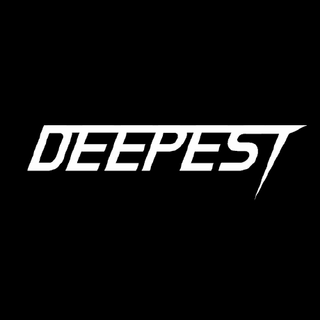

<h1 align="center">Hyunsoo Chung · 정현수</h1>

<h3 align="center">🇰🇷 KOR</h3>

  <b>AI Engineer</b> @ <a href="https://www.linkedin.com/company/cutback-video/posts/?feedView=all">CUTBACK</a> &nbsp;·&nbsp; <b>CS student</b> (on leave) @ <a href="https://en.snu.ac.kr">Seoul National University</a>

  Building <b>agentic computer-vision systems for automated video editing</b> — in production. 
  Full-stack developer who ships web apps end-to-end &nbsp;·&nbsp; deeply interested in <b>startups &amp; entrepreneurship</b>.

---

  
  &nbsp;&nbsp;&nbsp;&nbsp;
  
  &nbsp;&nbsp;&nbsp;&nbsp;
  
  &nbsp;&nbsp;&nbsp;&nbsp;
  

## Skills

**Software / AI Development** &nbsp;·&nbsp; **Problem Solving** &nbsp;·&nbsp; **Leadership** &nbsp;·&nbsp; **Communication**

---

## Tech Stack

### Languages

### AI / ML

### Backend & Infra

### Tools

---

<h3 align="center">Experience</h3>

<table align="center" width="780">
  <colgroup><col width="160"><col width="150"><col><col width="120"></colgroup>
  <tr>
    <td><b>Organization</b></td><td><b>Role</b></td><td><b>What I did</b></td><td align="center"><b>Period</b></td>
  </tr>
  <tr>
    <td><b>CUTBACK</b> <a href="https://www.linkedin.com/company/cutback-video/posts/?feedView=all">[LinkedIn]</a> <a href="https://cutback.video">[Website]</a> <b><i>Startup building video-editing AI.</i></b></td>
    <td>AI Engineer</td>
    <td>Building the production agent — <b>vision models &amp; visual embeddings</b> and <b>agentic LLM/VLM orchestration</b> (LangGraph). I own the <b>multi-camera switching</b> and <b>personalization</b> agents</td>
    <td align="center">Jan 2026 – Present</td>
  </tr>
</table>

<h3 align="center">Education &amp; Research</h3>

<table align="center" width="780">
  <colgroup><col width="160"><col width="150"><col><col width="120"></colgroup>
  <tr>
    <td><b>Institution</b></td><td><b>Field</b></td><td><b>Notes</b></td><td align="center"><b>Period</b></td>
  </tr>
  <tr>
    <td><b><a href="https://en.snu.ac.kr">Seoul National University</a></b></td>
    <td>Computer Science</td>
    <td>3rd year · currently on leave of absence (3학년 휴학)</td>
    <td align="center">Mar 2024 – Present</td>
  </tr>
  <tr>
    <td><b><a href="https://www.korea.edu">Korea University</a></b></td>
    <td>Biomedical Engineering</td>
    <td>Dropped out</td>
    <td align="center">Mar 2022 – Feb 2024</td>
  </tr>
  <tr>
    <td><b><a href="https://deepest.ai">Deepest</a></b></td>
    <td>Research · Member</td>
    <td>AI / ML / DL research society — studied ML/DL foundations and trained models from scratch (CNNs, RNNs, Transformers) through hands-on projects</td>
    <td align="center">Mar 2026 – Present</td>
  </tr>
</table>

<h3 align="center">Activities &amp; Projects</h3>

<table align="center" width="780">
  <colgroup><col width="160"><col width="150"><col><col width="120"></colgroup>
  <tr>
    <td><b>Project</b></td><td><b>Role</b></td><td><b>What I did</b></td><td align="center"><b>Period</b></td>
  </tr>
  <tr>
    <td><b>Waffle Studio</b> <a href="https://github.com/wafflestudio">[GitHub]</a> <a href="https://wafflestudio.com/">[Website]</a> <b><i>Dev team building services for the SNU community.</i></b></td>
    <td>Web Developer</td>
    <td>Shipped full-stack web products end-to-end — a second-hand marketplace and an internship-listing platform (SNU Intern)</td>
    <td align="center">Aug 2025 – Jan 2026</td>
  </tr>
  <tr>
    <td><b><a href="https://snuvc-venture-consulting.vercel.app">SNUVC</a></b></td>
    <td>Accelerator</td>
    <td>Accelerated early-stage student founders hands-on. To help non-technical teams ship software, I <b>set up simpler dev environments for them and coached them on getting the most out of agentic AI tools</b> — lowering the barrier to building. Worked closely with founders and their teams to connect them with leading domestic &amp; global VCs, and turned fast-moving conversations into practical next steps. Engaged startup communities at <b>CES 2026</b> for networking and insight. <b>Awarded the SNU 2026 CES Project Encouragement Prize.</b></td>
    <td align="center">Oct 2025 – Jan 2026</td>
  </tr>
  <tr>
    <td><b><a href="https://github.com/hyunsoochung-portfolio/Nudge_ai">Nudge AI</a></b></td>
    <td>Project / Tech Lead · Team of 3</td>
    <td>Built a product end-to-end: an AI that calls children on a parent's behalf to coach financial sense — child app, parent dashboard, a real-time AI-call flow, and a landing page</td>
    <td align="center">Sep 2025 – Nov 2025</td>
  </tr>
</table>

---

## About Me

1. **I build because I love it** — you'll often find me still deep in a problem at 2–3 a.m. or across the weekend, and I wouldn't have it any other way. I'm a **startup person at heart**: I get genuinely excited about hard technical problems, and I like the messy early stage where the plan keeps changing and there's never quite enough time — that's where I do my best work.

2. **I treat every part of the job as learning**, so I take ownership of whatever I work on as if it were my own and give every problem my full effort.

3. The value I prize most at a company is **brilliant colleagues** — I do my best work next to people who push me, and I care just as much about being a great teammate in return: keeping people in the loop, sharing what I know openly, and stepping up to lead when something needs an owner.

4. **Above all I care about the people who use what I build** — I start from real needs, design around them, and turn what I learn into clear writing, demos, and tools that make the next person's path easier.

---

## How I Work

1. **Define the problem** — I start by framing what actually needs solving, before touching any code.

2. **Talk to the customer** — I interview the people who'll use it to pin the problem down precisely and understand their real needs, not my assumptions.

3. **Define the answer first** — I nail down what the right output looks like for a given input (a ground-truth set, labels, or a target design) and develop against that answer key — a test-driven approach where the goal is fixed before the implementation.

4. **Design & build** — I turn that understanding into an approach, then implement it end-to-end, building toward the answer key until the system matches it.

5. **Iterate on two signals** — I refine against both the answer key from step 3 and real user feedback. Each round I measure the system's output against the labeled ground-truth set (and the target quality bar), find where it falls short, and close that gap — while putting it in front of users so the qualitative read and the quantitative score pull in the same direction.

6. **Optimize cost & latency** — once it works, I make it cheap and fast enough to run for real.

7. **Maintain & safeguard** — I wire the step-3 answer key into CI as a regression suite so my code or upstream changes can't silently break behavior, add production monitoring and drift detection, and feed real-world failures back into the evaluation set so the test bar keeps rising.

8. **Share what worked** — when an approach or technique proves out, I write it up so it outlives the one project: a clear doc others can build on, a walkthrough for the team, and onboarding material that gets new and junior engineers productive fast. Good patterns should spread, not stay in my head.

---

## Featured Projects

- **[agentic-video-editing](https://github.com/hyunsoochung-portfolio/agentic-video-editing)** *(flagship)* — Agentic computer-vision pipeline for automated multi-camera video editing: AI-driven shot analysis and camera/cut switching.
- **[agentic-ai-frameworks](https://github.com/hyunsoochung-portfolio/agentic-ai-frameworks)** — hands-on practice with each major agentic-AI framework ([OpenAI Agents SDK](https://github.com/hyunsoochung-portfolio/agentic-ai-frameworks/tree/main/openai-agents-sdk), [CrewAI](https://github.com/hyunsoochung-portfolio/agentic-ai-frameworks/tree/main/crewai), [Google ADK](https://github.com/hyunsoochung-portfolio/agentic-ai-frameworks/tree/main/google-adk), plus a [framework-free baseline](https://github.com/hyunsoochung-portfolio/agentic-ai-frameworks/tree/main/foundations)), each written up as a step-by-step walkthrough on my [blog](https://note24432.tistory.com) so the next developer picking up the stack can follow the path.
- **[ml-projects](https://github.com/hyunsoochung-portfolio/ml-projects)** · **[dl-projects](https://github.com/hyunsoochung-portfolio/dl-projects)** — R&D projects where I make prediction, vision, language, and forecasting models on public datasets — each with sweeps, ablations, and a per-project design-choice writeup · scikit-learn · TensorFlow / Keras · HuggingFace
- **[SNUVC-venture-consulting](https://github.com/hyunsoochung-portfolio/SNUVC-venture-consulting)** — Marketing landing site I built for SNU Venture Consulting (the accelerator where I worked with student founders and connected them with domestic & global VCs) — investor & professor network, team showcase, services breakdown, and a serverless contact form backed by Google Apps Script.
- **[secondhand-market-server](https://github.com/hyunsoochung-portfolio/secondhand-market-server)** · **[secondhand-market-web](https://github.com/hyunsoochung-portfolio/secondhand-market-web)** — Second-hand marketplace I worked on full-stack — live auctions with realtime bidding, in-app chat, virtual-currency wallet (deposit / withdraw / transfer), multi-image listings with drag-to-reorder, region-based browsing, and Google OAuth sign-in.
- **[snu-intern-web](https://github.com/hyunsoochung-portfolio/snu-intern-web)** — Internship discovery platform for SNU students I shipped full-stack — filter and sort listings by role / industry / recruiting status, bookmark roles, build a profile with CV upload, and sign in to keep state across sessions.
- **[Nudge AI](https://github.com/hyunsoochung-portfolio/Nudge_ai)** — a product I built end-to-end: an AI that phones children on a parent's behalf to coach financial sense and good habits. A child app (spending, missions, savings), a parent dashboard (approvals, AI rule-teaching, call logs), a real-time AI-call flow, and its marketing landing page · React

---

## Writing

I keep a [**technical blog**](https://note24432.tistory.com) where I document agentic-AI frameworks as I work through them. Each post is the walkthrough I'd want when picking up a new framework — full setup, runnable code, and the reasoning behind each choice.

---

## Contact

